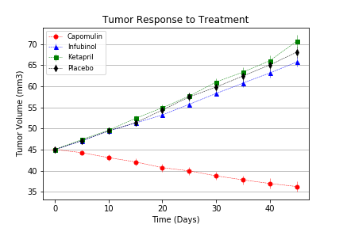
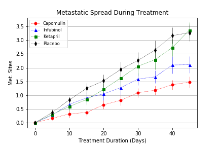
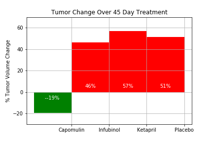

# Pymaceuticals-Inc
Our objective in this project is to analyze the drugs data to show how four treatments (Capomulin, Infubinol, Ketapril, and Placebo) compare.

# Project Review
In this project, we've been given access to the complete data from their most recent animal study. In this study, 250 mice were treated through a variety of drug regimes over the course of 45 days. Their physiological responses were then monitored over the course of that time. Our objective is to analyze the data to show how four treatments (Capomulin, Infubinol, Ketapril, and Placebo) compare.

To do this our tasked with:
* Creating a scatter plot that shows how the tumor volume changes over time for each treatment.

* Creating a scatter plot that shows how the number of [metastatic](https://en.wikipedia.org/wiki/Metastasis) (cancer spreading) sites changes over time for each treatment.

* Creating a scatter plot that shows the number of mice still alive through the course of treatment (Survival Rate)

* Creating a bar graph that compares the total % tumor volume change for each drug across the full 45 days.

